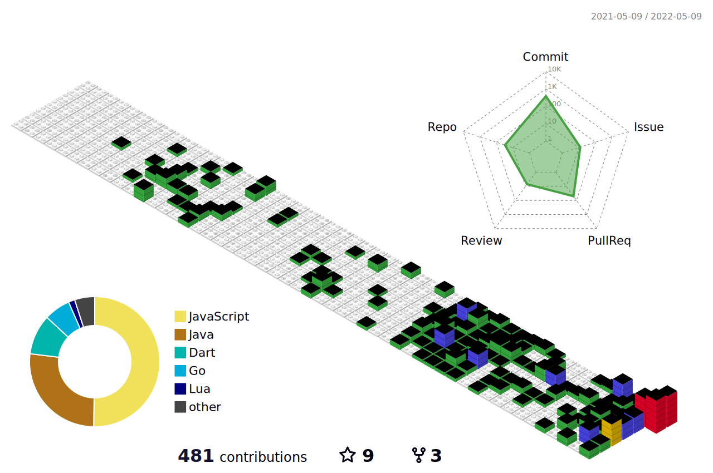

# :rocket: About me

## Hi there 👋

Hi, I'm **John Chever**, call me **Chever** will be fine. Chever is the resonance of my Chinese name; it will sound very friendly to me.

Time is fleeting:( There are a lot of things waiting for me to do.

- Languages: Chinese | English
- Active Timezone: 12:00 - 23:00 (Asia/Shanghai, UTC+8) | 4:00 - 15:00 (UTC)
- Currently working on:
  - K8s Ingress
  - Apache APISIX
- Open-source activities:
  - OSPP 2021 tuna NFC Project Finisher
  - Apache APISIX contributor

## 📊 Stats

<!--
**Chever-John/Chever-John** is a ✨ _special_ ✨ repository because its `README.md` (this file) appears on your GitHub profile.

Here are some ideas to get you started:

- 🔭 I’m currently working on ...
- 🌱 I’m currently learning ...
- 👯 I’m looking to collaborate on ...
- 🤔 I’m looking for help with ...
- 💬 Ask me about ...
- 📫 How to reach me: ...
- 😄 Pronouns: ...
- ⚡ Fun fact: ...
-->
